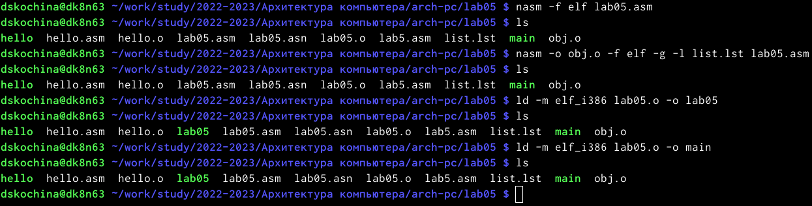

---
## Front matter
title: "Отчёт по лабораторной работе №5"
subtitle: "Создание и процесс обработки программ на языке ассемблера NASM"
author: "Дарья Сергеевна Кочина"

## Generic otions
lang: ru-RU
toc-title: "Содержание"

## Bibliography
bibliography: bib/cite.bib
csl: pandoc/csl/gost-r-7-0-5-2008-numeric.csl

## Pdf output format
toc: true # Table of contents
toc-depth: 2
lof: true # List of figures
fontsize: 12pt
linestretch: 1.5
papersize: a4
documentclass: scrreprt
## I18n polyglossia
polyglossia-lang:
  name: russian
  options:
	- spelling=modern
	- babelshorthands=true
polyglossia-otherlangs:
  name: english
## I18n babel
babel-lang: russian
babel-otherlangs: english
## Fonts
mainfont: PT Serif
romanfont: PT Serif
sansfont: PT Sans
monofont: PT Mono
mainfontoptions: Ligatures=TeX
romanfontoptions: Ligatures=TeX
sansfontoptions: Ligatures=TeX,Scale=MatchLowercase
monofontoptions: Scale=MatchLowercase,Scale=0.9
## Biblatex
biblatex: true
biblio-style: "gost-numeric"
biblatexoptions:
  - parentracker=true
  - backend=biber
  - hyperref=auto
  - language=auto
  - autolang=other*
  - citestyle=gost-numeric
## Pandoc-crossref LaTeX customization
figureTitle: "Рис."
tableTitle: "Таблица"
listingTitle: "Листинг"
lofTitle: "Список иллюстраций"
lolTitle: "Листинги"
## Misc options
indent: true
header-includes:
  - \usepackage{indentfirst}
  - \usepackage{float} # keep figures where there are in the text
  - \floatplacement{figure}{H} # keep figures where there are in the text
---

# Цель работы

Освоение процедуры компиляции и сборки программ, написанных на ассемблере NASM.

# Задание

Освоить процедуры компиляции и сборки программ, написанных на ассемблере NASM.

# Теоретическое введение

**Язык ассемблера** — машинно-ориентированный язык низкого уровня. Можно считать, что он больше любых других языков приближен к архитектуре ЭВМ и её аппаратным возможностям, что позволяет получить к ним более полный доступ, нежели в языках высокого уровня, таких как C/C++, Perl, Python и пр. Таким образом, язык ассемблера — это язык, с помощью которого понятным для человека образом пишутся команды для процессора.

Преобразование или трансляция команд с языка ассемблера в исполняемый машинный код осуществляется специальной программой транслятором — **Ассемблер.**

**NASM** — это открытый проект ассемблера, версии которого доступны под различные операционные системы и который позволяет получать объектные файлы для этих систем. В NASM используется Intel-синтаксис и поддерживаются инструкции x86-64.

# Выполнение лабораторной работы

1. Я создала каталог lab05 для работы с программами на языке ассемблера NASM, затем перешла в него. (рис. [-@fig:001])

{ #fig:001 width=70% }

2. Я создала файл hello.asm и открыла его с помощью текстового редактора gedit. (рис. [-@fig:002])

{ #fig:002 width=70% }

3. Я ввела в файл нужный текст. (рис. [-@fig:003])

{ #fig:003 width=70% }

4. Я скомпилировала текст с помощью транслятора NASM. (рис. [-@fig:004])

{ #fig:004 width=70% }

5. Я скомпилировала файл hello.asm в obj.o. (рис. [-@fig:005])

{ #fig:005 width=70% }

6. Обработка компановщиком файла hello.o и obj.o. (рис. [-@fig:006])

{ #fig:006 width=70% }

7. Я запустила файл hello. (рис. [-@fig:007])

{ #fig:007 width=70% }

**Выполнение самостоятельной работы**

1. С помощью команды cp я сделала копию файла hello.asm с именем lab05.asm. (рис. [-@fig:008])

{ #fig:008 width=70% }

2. С помощью текстового редактора gedit я внесла изменения в файл lab05.asm, чтобы он выводил моё имя и фамилию. (рис. [-@fig:009])

{ #fig:009 width=70% }

3. Я оттранслировала полученный текст и выполнила компоновку файла. (рис. [-@fig:010])

{ #fig:010 width=70% }

4. Я запустила файл lab05. (рис. [-@fig:011])

{ #fig:011 width=70% }

5. Я скопировала файлы в локальный репозиторий. (рис. [-@fig:012])

{ #fig:012 width=70% }

6. Я загрузила файлы на GitHub. (рис. [-@fig:013])

{ #fig:013 width=70% }

# Выводы

В ходе выполнения данной лабораторной работы я освоила процедуры компиляции и сборки программ, написанных на ассемблере NASM.

